# Library Management System

**Author:** Kushagra Gautam · [github.com/Kushagra-Gautam](https://github.com/Kushagra-Gautam) · kushagra.gautammark@gmail.com

A console-based Library Management System in Core Java, built to demonstrate object-oriented design,
the SOLID principles, and design patterns applied where they earn their place rather than as
decoration.

No frameworks, no database, no external jars — it compiles with plain `javac` and runs on any JDK 17+.
Logging uses `java.util.logging`, the JDK's own framework.

```bash
javac -d out $(find src -name "*.java")
java -cp out com.library.Main --demo    # guided walkthrough of every feature
java -cp out com.library.Main --test    # 136-check test suite
java -cp out com.library.Main           # interactive console
```

---

## Contents

- [The central design decision](#the-central-design-decision)
- [Class diagram](#class-diagram)
- [Features](#features)
- [SOLID principles](#solid-principles)
- [Design patterns](#design-patterns)
- [Collections and algorithms](#collections-and-algorithms)
- [Logging](#logging)
- [Package structure](#package-structure)
- [Building and running](#building-and-running)
- [Testing](#testing)
- [Design notes](#design-notes)

---

## The central design decision

Almost everything else follows from one choice: **a catalogue record and a physical copy are
different things.**

A library holds one catalogue entry for *Clean Code* but four physical copies of it — possibly spread
across three branches, one on loan, one being held for a reservation, one in a van between branches.

```
LibraryItem  (ISBN 9780132350884, "Clean Code", Robert C. Martin)
     |
     +-- ItemCopy BC-00001  @ BR-DEL  BORROWED
     +-- ItemCopy BC-00002  @ BR-DEL  AVAILABLE
     +-- ItemCopy BC-00003  @ BR-MUM  IN_TRANSIT
     +-- ItemCopy BC-00004  @ BR-MUM  ON_HOLD
```

Separating them means availability, lending, reservations and transfers are all properties of a
*copy*, never of the catalogue record. Multi-branch support and the hold queue then need no special
machinery — they are just copy state. A design that put `isAvailable` on `Book` would have needed
rewriting the moment a second copy or a second branch appeared.

---

## Class diagram

```mermaid
classDiagram
    direction TB

    class LibraryItem {
        <<abstract>>
        -String id
        -String title
        -int publicationYear
        -Genre genre
        +getItemType()* String
        +getContributor()* String
        +getSummary()* String
        +getSearchableText() String
    }

    class Book {
        -String author
        -String publisher
        -int pageCount
        +getIsbn() String
    }

    class Magazine {
        -String publisher
        -int issueNumber
    }

    class BookBuilder {
        <<builder>>
        +author(String) Builder
        +genre(Genre) Builder
        +build() Book
    }

    class ItemCopy {
        -String barcode
        -String itemId
        -String branchId
        -CopyStatus status
        +isAvailable() boolean
    }

    class Patron {
        -String patronId
        -MembershipType membershipType
        -List~String~ borrowingHistory
        -Set~Genre~ preferredGenres
        +recordBorrowing(String)
        +getDistinctBorrowedItems() Set
    }

    class Loan {
        -String loanId
        -String barcode
        -LocalDate dueOn
        -LoanStatus status
        +daysOverdue(LocalDate) long
    }

    class Reservation {
        -String reservationId
        -String itemId
        -ReservationStatus status
        -String heldBarcode
    }

    class Branch {
        -String branchId
        -String name
    }

    class Searchable {
        <<interface>>
        +matches(String) boolean
        +matchesAny(String...) boolean
    }

    class SearchStrategy {
        <<interface>>
        +search(Collection, String) List
    }

    class TitleSearchStrategy
    class AuthorSearchStrategy
    class IsbnSearchStrategy
    class GenreSearchStrategy
    class CompositeSearchStrategy

    class LoanPolicy {
        <<interface>>
        +getLoanPeriodDays() int
        +getMaxConcurrentLoans() int
        +calculateFine(long) double
    }

    class BasicLoanPolicy
    class StudentLoanPolicy
    class PremiumLoanPolicy
    class LoanPolicyResolver

    class RecommendationStrategy {
        <<interface>>
        +recommend(Patron, List, int) List
    }

    class GenreAffinityStrategy
    class AuthorAffinityStrategy
    class PopularityStrategy
    class CollaborativeFilteringStrategy
    class CompositeRecommendationStrategy

    class LibraryEventListener {
        <<interface>>
        +onEvent(LibraryEvent)
        +isInterestedIn(EventType) boolean
    }

    class EventPublisher {
        -List~LibraryEventListener~ listeners
        +subscribe(LibraryEventListener)
        +publish(LibraryEvent)
    }

    class AuditTrailListener
    class NotificationListener

    class NotificationChannel {
        <<interface>>
        +send(Patron, String, String)
        +canReach(Patron) boolean
    }

    class ConsoleNotificationChannel
    class EmailNotificationChannel
    class SmsNotificationChannel
    class NotificationService

    class Repository~T,I~ {
        <<interface>>
        +save(T) T
        +findById(I) Optional
        +findAll() List
    }

    class ItemRepository {
        <<interface>>
    }
    class PatronRepository {
        <<interface>>
    }
    class CopyRepository {
        <<interface>>
    }
    class LoanRepository {
        <<interface>>
    }
    class ReservationRepository {
        <<interface>>
    }

    class InMemoryRepository~T,I~ {
        <<abstract>>
        -Map~I,T~ store
    }

    class CatalogService {
        <<interface>>
    }
    class PatronService {
        <<interface>>
    }
    class InventoryService {
        <<interface>>
    }
    class LendingService {
        <<interface>>
    }
    class ReservationService {
        <<interface>>
    }
    class TransferService {
        <<interface>>
    }
    class RecommendationService {
        <<interface>>
    }

    class DefaultCatalogService
    class DefaultLendingService
    class DefaultReservationService
    class DefaultInventoryService
    class DefaultTransferService

    class LibraryItemFactory {
        <<factory>>
        +create(String, Map)$ LibraryItem
    }

    class LibraryApplication {
        <<composition root>>
    }

    LibraryItem <|-- Book
    LibraryItem <|-- Magazine
    Searchable <|.. LibraryItem
    Book *-- BookBuilder

    SearchStrategy <|.. TitleSearchStrategy
    SearchStrategy <|.. AuthorSearchStrategy
    SearchStrategy <|.. IsbnSearchStrategy
    SearchStrategy <|.. GenreSearchStrategy
    SearchStrategy <|.. CompositeSearchStrategy
    CompositeSearchStrategy o-- SearchStrategy

    LoanPolicy <|.. BasicLoanPolicy
    LoanPolicy <|.. StudentLoanPolicy
    LoanPolicy <|.. PremiumLoanPolicy
    LoanPolicyResolver o-- LoanPolicy

    RecommendationStrategy <|.. GenreAffinityStrategy
    RecommendationStrategy <|.. AuthorAffinityStrategy
    RecommendationStrategy <|.. PopularityStrategy
    RecommendationStrategy <|.. CollaborativeFilteringStrategy
    RecommendationStrategy <|.. CompositeRecommendationStrategy
    CompositeRecommendationStrategy o-- RecommendationStrategy

    LibraryEventListener <|.. AuditTrailListener
    LibraryEventListener <|.. NotificationListener
    EventPublisher o-- LibraryEventListener
    NotificationListener --> NotificationService

    NotificationChannel <|.. ConsoleNotificationChannel
    NotificationChannel <|.. EmailNotificationChannel
    NotificationChannel <|.. SmsNotificationChannel
    NotificationService o-- NotificationChannel

    Repository <|-- ItemRepository
    Repository <|-- PatronRepository
    Repository <|-- CopyRepository
    Repository <|-- LoanRepository
    Repository <|-- ReservationRepository
    Repository <|.. InMemoryRepository

    CatalogService <|.. DefaultCatalogService
    LendingService <|.. DefaultLendingService
    ReservationService <|.. DefaultReservationService
    InventoryService <|.. DefaultInventoryService
    TransferService <|.. DefaultTransferService

    DefaultCatalogService --> ItemRepository
    DefaultCatalogService --> SearchStrategy
    DefaultCatalogService ..> LibraryItemFactory
    DefaultLendingService --> LoanRepository
    DefaultLendingService --> CopyRepository
    DefaultLendingService --> LoanPolicyResolver
    DefaultLendingService --> EventPublisher
    DefaultLendingService ..> ReservationService
    DefaultReservationService --> ReservationRepository
    DefaultReservationService --> EventPublisher
    DefaultInventoryService --> CopyRepository
    DefaultTransferService --> CopyRepository

    ItemCopy --> CopyStatus
    Loan --> LoanStatus
    Reservation --> ReservationStatus
    Patron --> MembershipType
    Branch <.. ItemCopy

    LibraryApplication ..> DefaultCatalogService
    LibraryApplication ..> DefaultLendingService
    LibraryApplication ..> DefaultReservationService
    LibraryApplication ..> EventPublisher
```



### Relationships in words

| Relationship | Type | Meaning |
|---|---|---|
| `Book`, `Magazine` → `LibraryItem` | Inheritance | Both are catalogued works; everything downstream depends on the abstraction |
| `LibraryItem` → `ItemCopy` | One-to-many by ID | One catalogue record, many physical copies |
| `ItemCopy` → `Branch` | Association by ID | A copy is held at exactly one branch |
| `Loan` → `ItemCopy`, `Patron` | Association by ID | A loan joins one copy to one patron |
| `Reservation` → `LibraryItem`, `Patron` | Association by ID | A hold is on the *work*, satisfied by any copy |
| `CompositeSearchStrategy` → `SearchStrategy` | Composite | Aggregates the interface it implements |
| `Bill`-style policy: `LoanPolicyResolver` → `LoanPolicy` | Strategy | Tier selects rules at runtime |
| `EventPublisher` → `LibraryEventListener` | Observer | Publisher knows only the interface |
| `NotificationService` → `NotificationChannel` | Strategy | Delivery route chosen per patron |
| `Default*Service` → `*Repository` | Dependency inversion | Services depend on interfaces only |
| `LibraryApplication` → everything | Composition root | The single place concrete classes are named |

---

## Features

### Core requirements

| Requirement | Implementation |
|---|---|
| **Book management** | `Book` with title, author, ISBN, publication year, genre, publisher, edition, page count. Add, update and remove through `CatalogService`. |
| **Search** | Five interchangeable strategies — title, author, ISBN, genre, and a composite union. ISBN search normalises hyphens, so `978-0132350884` and `9780132350884` both match. |
| **Patron management** | `Patron` with membership tier and contact preference; register, update, block/unblock. |
| **Borrowing history** | Every checkout appends to the patron's history, exposed as an unmodifiable list and consumed by the recommendation engine. |
| **Lending** | Checkout by title (any free copy) or by specific barcode; return with automatic fine calculation; renewal, blocked when someone is waiting. |
| **Inventory** | Available, borrowed and total counts derived from copy status, so they can never drift out of step. |

### Optional extensions — all three implemented

| Extension | Implementation |
|---|---|
| **Multi-branch** | Copies belong to branches; per-branch inventory; two-phase transfers where a copy is `IN_TRANSIT` and unlendable until booked in at the far end. |
| **Reservations** | FIFO queue per title. Reserving is refused when a copy is on the shelf. On return, the head of the queue gets the copy put `ON_HOLD` — not shelved — so nobody can take it first. |
| **Notifications** | Three channels (console, email, SMS) chosen by patron preference, with fallback when the preferred route has no contact details. Triggered by events, not by direct calls from the lending code. |
| **Recommendations** | Four signals — genre affinity, same author, collaborative filtering, popularity — blended by a weighted composite. |

### Business rules enforced

- A blocked patron cannot borrow
- The borrowing limit comes from the patron's tier, not a hard-coded number
- A copy on hold, on loan or in transit cannot be lent
- Reserving a title that is on the shelf is refused
- The same patron cannot join a queue twice
- A loan cannot be renewed while someone is waiting for the title
- A copy on loan cannot be withdrawn from stock
- A copy cannot be transferred to the branch that already holds it

---

## SOLID principles

### Single responsibility

Each class has one reason to change. The clearest evidence is what is **absent**: `Loan` knows how to
tell you it is four days overdue, but not what a day costs — that is `LoanPolicy`. `DefaultLendingService`
performs a return, but does not send the notification that follows — that is a listener. `ItemRepository`
stores records, but does not decide what "matching" means — that is a `SearchStrategy`.

A fine-rate change touches one policy class. A change to notification wording touches one listener.
Neither touches lending.

### Open/closed

Extension points are interfaces with multiple implementations, so new behaviour arrives as new classes:

```java
public interface SearchStrategy {
    List<LibraryItem> search(Collection<LibraryItem> items, String query);
}
```

Adding a publisher search means writing `PublisherSearchStrategy` — `DefaultCatalogService`,
`ItemRepository` and every existing strategy stay untouched. The same applies to `LoanPolicy`,
`RecommendationStrategy`, `NotificationChannel` and `LibraryEventListener`.

`LoanPolicyResolver` uses an `EnumMap` rather than a `switch`, so registering a policy for a new tier
is a map entry rather than an edit to a conditional.

### Liskov substitution

`Magazine` is not decoration — it is the proof. It is catalogued, searched, lent and returned by
exactly the same code paths as `Book`, because every consumer depends on `LibraryItem` and nothing
downcasts. `AuthorSearchStrategy` calls `getContributor()`, which returns an author for a book and a
publisher for a magazine; the strategy neither knows nor cares.

The test suite verifies this directly: a magazine is borrowed and returned through the same
`LendingService` calls used for books.

Subclasses never weaken a precondition or strengthen a postcondition. Where `PremiumLoanPolicy`
overrides `calculateFine` to add a grace period, it still honours the contract — a non-negative fine
that never decreases as days increase.

### Interface segregation

Interfaces are small and purpose-built rather than one fat contract:

- `Searchable` — matching only (2 methods, one abstract)
- `NotificationChannel` — delivery only, no domain knowledge
- `LibraryEventListener` — reaction only, no delivery knowledge
- `SearchStrategy` — a single abstract method

`NotificationListener` implements `LibraryEventListener` and *uses* a `NotificationChannel`. Merging
them would force every listener to know how to send an SMS, and every channel to know what a
reservation is.

Repository interfaces extend a generic base and add only the queries that specific store genuinely
needs — `CopyRepository` has `findFirstAvailable`, and `BranchRepository` adds nothing at all.

### Dependency inversion

Every service depends on abstractions, injected through its constructor:

```java
public DefaultLendingService(LoanRepository loanRepository, CopyRepository copyRepository,
                             ItemRepository itemRepository, PatronService patronService,
                             LoanPolicyResolver policyResolver, EventPublisher eventPublisher) {
```

No service ever calls `new` on a repository. Concrete classes are named in exactly one place —
`LibraryApplication`, the composition root — so replacing the in-memory maps with JDBC means editing
six field declarations and nothing else.

This is also what makes the test suite possible: each test group builds its own application with its
own empty stores, because nothing reaches for a global.

---

## Design patterns

The brief asks for at least two. Six are implemented, each because the problem asked for it.

### 1. Strategy — three separate uses

**Search** (`SearchStrategy`): the catalogue is searched five different ways; the service holds the
interface and the caller picks the implementation.

**Lending terms** (`LoanPolicy`): loan period, borrowing limit and fine rate vary by membership tier.
Without the pattern, `DefaultLendingService` would carry a conditional that grows with every new tier.

**Recommendations** (`RecommendationStrategy`): four ways to suggest a title, each self-contained.

### 2. Observer

`EventPublisher` is the subject; `AuditTrailListener` and `NotificationListener` are observers.

This is what keeps returning a book independent of everything that follows it. `returnCopy` publishes
`BOOK_RETURNED`; it does not know that a reservation will be fulfilled or an SMS sent. Listeners
declare their interests through `isInterestedIn(EventType)`, and a listener that throws is logged and
skipped so one faulty observer cannot abort the transaction.

### 3. Factory

`LibraryItemFactory` builds a `Book` or `Magazine` from loosely typed input, validating as it goes.
Callers name the format they want, never the class, so an invalid record cannot reach the catalogue
through a side door.

### 4. Builder

`Book.Builder` — a book has eight attributes, five optional. A constructor would be a line of
same-typed arguments waiting to be transposed. Required fields are constructor arguments of the
builder itself, so an incomplete book cannot be built:

```java
Book book = new Book.Builder("9780134685991", "Effective Java")
        .author("Joshua Bloch")
        .publicationYear(2018)
        .genre(Genre.TECHNOLOGY)
        .build();
```

### 5. Repository

`Repository<T, I>` abstracts storage; `InMemoryRepository<T, I>` implements the generic operations
once and subclasses supply only an ID-extracting function.

### 6. Composite

`CompositeSearchStrategy` and `CompositeRecommendationStrategy` each implement the very interface
they aggregate, so a caller cannot tell a composite from a single strategy. This is what lets
"search everything" and "blended recommendations" exist with no special case anywhere.

---

## Collections and algorithms

| Structure | Where | Why |
|---|---|---|
| `LinkedHashMap` | `InMemoryRepository` | O(1) lookup by ID **and** stable insertion order for listings |
| `HashMap` / `HashSet` | Recommendation strategies | O(1) membership tests while scanning |
| `EnumMap` | `LoanPolicyResolver`, `NotificationService`, genre histogram | Array-backed, faster and tighter than `HashMap` for enum keys |
| `LinkedHashSet` | `Patron.preferredGenres`, composite search results | De-duplicates while preserving order |
| `List` | Borrowing history, queues, event log | Order matters; duplicates are meaningful |
| `Optional` | Every repository lookup | Makes "not found" explicit rather than a null waiting to happen |

**Collaborative filtering** is the most algorithmically interesting piece. For each other patron, the
overlap with this patron's history is measured by set intersection, iterating the *smaller* set so
cost is bounded by the shorter history. Titles held by a neighbour but not by this patron are scored
by the size of that overlap — the more reading two members share, the more weight that neighbour's
other titles carry. Overall cost is O(p × h) for p patrons and h titles per history: linear in the
data actually present, with no pairwise similarity matrix to build.

**The reservation queue** is derived, not stored. `findWaitingQueue` sorts waiting reservations by
the date placed, so there is no separate queue structure that could drift out of step with the
reservations themselves.

---

## Logging

`java.util.logging` — the JDK's own framework — configured centrally in `LoggingConfig`:

- **Console handler** at `INFO` for the operator
- **File handler** at `ALL` writing `logs/library.log` for the audit trail
- A custom one-line formatter, so log output stays readable beside menu output

```
2026-09-12 12:25:16  INFO    DefaultLendingService  Loan L-006: copy BC-00001 of 'Clean Code' to P-001, due 2026-09-26
2026-09-12 12:25:16  INFO    AuditTrailListener     AUDIT BOOK_BORROWED: 'Clean Code' is due back on 2026-09-26
```

Levels are used deliberately: `INFO` for business events worth an audit record, `FINE` for diagnostic
detail such as which search strategy ran, `WARNING` for rejected operations and failed listeners.
Expensive messages use lambda suppliers (`LOGGER.fine(() -> ...)`) so the string is never built when
the level is disabled.

> **Why not SLF4J or Log4j?** The brief rules out external dependencies and the project must build
> with plain `javac`, with no build tool fetching jars. `java.util.logging` has the same shape —
> named loggers, levels, handlers, formatters — so migrating would mean changing `LoggingConfig` and
> the import lines, nothing else.

---

## Package structure

```
src/com/library/
├── Main.java                     entry point and mode selection
├── app/
│   ├── LibraryApplication.java   composition root - the only place concrete classes are named
│   ├── LibraryConsole.java       interactive menus
│   └── DemoRunner.java           scripted walkthrough + sample data
├── domain/
│   ├── model/                    LibraryItem, Book, Magazine, ItemCopy, Patron, Loan,
│   │                             Reservation, Branch
│   └── enums/                    CopyStatus, LoanStatus, ReservationStatus, Genre,
│                                 MembershipType, EventType, NotificationChannelType
├── repository/                   Repository<T,I> + 6 interfaces
│   └── inmemory/                 InMemoryRepository<T,I> + 6 implementations
├── service/                      7 service interfaces
│   └── impl/                     7 default implementations
├── search/                       SearchStrategy + 5 implementations
├── recommendation/               RecommendationStrategy + 5 implementations
├── policy/                       LoanPolicy + 3 implementations + resolver
├── event/                        LibraryEvent, EventPublisher, 2 listeners
├── notification/                 NotificationChannel + 3 channels + service
├── factory/                      LibraryItemFactory
├── exception/                    LibraryException + 8 subtypes
├── util/                         LoggingConfig, Validator, IdGenerator
└── test/                         LibraryTestRunner
```

**88 source files, ~6,500 lines.**

---

## Building and running

**Prerequisite:** JDK 17 or above (tested on JDK 21).

### Linux / macOS

```bash
git clone https://github.com/Kushagra-Gautam/library-management-system.git
cd library-management-system

javac -d out $(find src -name "*.java")
java -cp out com.library.Main --demo
```

### Windows PowerShell

```powershell
javac -d out (Get-ChildItem -Recurse -Filter *.java src | ForEach-Object { $_.FullName })
java -cp out com.library.Main --demo
```

### Modes

| Flag | Effect |
|---|---|
| *(none)* | Interactive console, pre-loaded with sample data |
| `--demo` | Guided walkthrough of every feature, then exits |
| `--test` | Runs the 136-check test suite, exits 0 on success |
| `--quiet` | Suppresses console logging (file logging continues) |
| `--verbose` | Shows `FINE` level logging |
| `--help` | Usage |

`--demo --quiet` gives the cleanest read of the feature walkthrough; drop `--quiet` to see the
logging alongside it.

### JavaDocs

```bash
javadoc -d docs/javadoc -sourcepath src -subpackages com.library
```

---

## Testing

`LibraryTestRunner` is a hand-written harness — no JUnit, keeping the no-dependency constraint. **136
checks across 17 groups:**

validation · builder · factory · catalogue CRUD · search strategies · patron management · inventory
counts · lending happy path · lending rules · loan policies · fines and overdue · reservation queue ·
reservation notification · multi-branch transfer · recommendations · observer bus · polymorphism and
substitutability

```bash
java -cp out com.library.Main --test --quiet
```

```
================================================================================
  RESULT: 136 passed, 0 failed, 136 total
================================================================================
```

Each group builds a fresh `LibraryApplication`, so no test depends on another's state — which is only
possible because every service takes its collaborators through a constructor.

---

## Design notes

### Why services expose interfaces even with one implementation

`CatalogService` has one implementation today. The interface still earns its place: it documents the
contract separately from the mechanism, and it means `DefaultLendingService` depends on
`PatronService` rather than `DefaultPatronService` — so a caching or auditing decorator could be
slipped in with no change to lending.

### Why lending holds `ReservationService` as an optional setter

Lending and reservations refer to each other: a return fulfils a reservation, and a renewal must
check the queue. Constructor injection both ways would deadlock. Making the reservation service an
optional setter breaks the cycle *and* means lending works perfectly well with the reservation module
absent entirely — `if (reservationService != null)` is the whole of the coupling.

### Why a returned copy goes ON_HOLD rather than AVAILABLE

If a returned copy were shelved as available, the next walk-in patron could borrow it before the
person who has been waiting three weeks collects it. `ON_HOLD` is a distinct status precisely so the
copy is invisible to `findFirstAvailable` while it is being kept for someone. The test suite verifies
that a third patron is refused.

### Why transfers are two-phase

A copy does not teleport. `initiateTransfer` marks it `IN_TRANSIT` and records the destination;
`completeTransfer` books it in and makes it lendable again. Modelling the journey as a state is what
stops a copy being lent from a branch that does not physically hold it yet.

### Why exceptions are unchecked

All nine extend `LibraryException extends RuntimeException`. Business methods are not cluttered with
`throws` clauses for conditions the caller usually cannot repair locally, and the console catches
`LibraryException` once per menu — so a failure shows a clean message and returns to the menu rather
than unwinding the program.

`InvalidInputException` chains the original `NumberFormatException` as its cause, so the underlying
failure is never lost.

### Comments

JavaDoc appears on classes and on methods whose contract is not obvious from the signature. There is
no inline `//` commentary: where a line needed explaining, the preference was to rename or extract
rather than annotate. A method called `findFirstAvailable` does not need a comment saying it finds
the first available copy.

---

## Possible extensions

- Swap `InMemoryRepository` for a JDBC implementation — only `LibraryApplication` changes
- Add JUnit 5 alongside the manual harness
- Reservation expiry (a hold that is not collected within *n* days returns to the shelf)
- Fine payment and patron account balances
- Move `EventPublisher` to asynchronous dispatch on an `ExecutorService`
